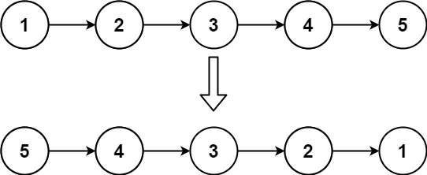
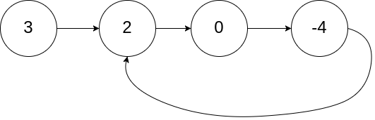

# Instructions  

This assignment will introduce you to the LinkedList data structure as well as common interview/ competetive programming techniques realated to them. 

## Part 1: Create a Linked List class
- Complete `LinkedList.java`
- Impliment a singly-linked list: each node only points to the next node
- Use the provided Node class
- Practice using generic types

## Part 2: Linked List challenge questions
These questions will not use your LinkedList class but rather just a series of Nodes. This is so you can not add finctionality to you class to solve the problems. Do not use any apce for any of these problems.

- `findMiddleElement`
  - Find the middle element of a random LinkedList.
  - If there are two middle nodes, return the second middle node.
  - Try to do this in 1 pass through the list.
  - Example:
    
     Since the list has two middle nodes with values 3 and 4, we return the second one.
- `getNthFromLastElement`
  - Given the head of a linked list, return the nth node from the end of the list. Return Null if out of bounds.
  - Try to do this in 1 pass through the list.
  - Example n=2:
    
    The node containing 4 is the second to last element
    
- `reverseList`
  - Given the head of a singly linked list, reverse the list, and return the reversed list.
  - Try to do this in 1 pass through the list.
  - Example:
   
  Return the new head (node containing 5)
    
- `containsCycle`
  - Given head, the head of a linked list, determine if the linked list has a cycle in it.
  - Return true if there is a cycle in the linked list. Otherwise, return false.
  - Example:

There is a cycle in the linked list, where the tail connects to the 1st node.

  