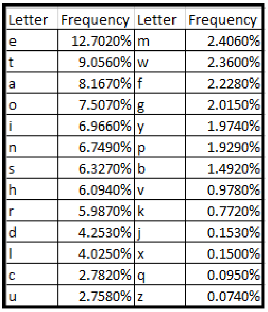

# Instructions  

Basic cyphers can be broken using the frequency of letters in the english language. The methodology behind frequency analysis relies on the fact that in any language, each letter has its own personality. The most obvious trait that letters have is the frequency with which they appear in a language. Clearly in English the letter "Z" appears far less frequently than, say, "A". Thus, if we know the most common letter in English is "E" and we intercept a message, and the most common letter is "P", we can guess that "P" was used to encrypt "E", and thus replace all the "P"'s with "E".

## Steps
- Go through the warAndPeace text file and store the frequency of each letter in a Hashmap. Convert all characters to lowercase and ingnore anything that is not a-z
- Repeat with the intercept.txt file to get the frequency of the encoded message.
- Based on the frequency of the characters in the two files create a mapping for each letter.
- Decrypt the secret message using the mapping!

---

Note: Every text has a different frequency of words and the message is reletively short so the mapping and frequency aren't perfect. Here is a chart of the most common letters in english if you wnat to check your english frequency table against it:
