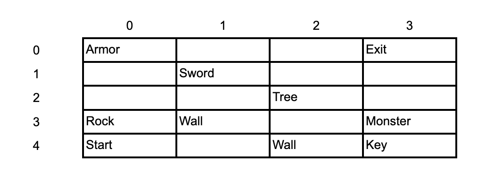

# Zork
## Background
Zork is a text-based adventure game first released in 1977. The game challenged players to navigate a byzantine underground world full of caves and rivers as they battled gnomes, a troll, and a Cyclops to collect such treasures as a jewel-encrusted egg and a silver chalice.

#### [Play Zork Here!](https://www.retrogames.cz/play_1544-DOS.php?language=EN)

## Overview
In this project, you will be creating a simplified version of the Zork game. The objective of the game is to defeat the Monster to get the key and safely exit. The game will take place on a 2D map that you will represent using a nested list. Some of the cells of the list will contain items that you can pick up and use in your quest. You will also create a player class that will represent your character by storing its current position and inventory.

## Gameplay Example
```
What would you like to do? LEFT
>> You see a sword.
What would you like to do? TAKE
>> You picked up the sword.
What would you like to do? LEFT
>> You see nothing.
What would you like to do? LEFT
>> There is a wall blocking your path.
What would you like to do? UP
>> You see a monster.
What would you like to do? USE
What would you like to use? SWORD
>> You used the sword and defeated the monster!
```


## Map:
Represent the following as a 2D list:



## Map Items:

- **Sword**:
You can take the sword. Using the sword has a 75% chance of defeating the monster. Using the sword on anything else has no effect.
- **Rock**:
You can take the rock. Using the rock has a 25% chance of defeating the monster. Using the sword on anything else has no effect.
- **Armor**: You can take the armor. EC: Using the armor puts it on and increases your chance of defeating the monster by 25%.
- **Tree**:
You can not take or use anything on the tree.
- **Wall**:
Can not go to this square. If a player tries to go to this square, print a message saying they are blocked by a wall and keep them on the same square.
- **Key**:
You can take the key. Using the key on the exit opens the exit and ends the game. Using the sword on anything else has no effect.
- **Exit**:
Can only be opened with the key. If the player successfully opens the exit the game will print a celebratory message and the program will end.
- **Monster**:
Once you reach this cell you must either fight the monster or run away. Using bare hands has a 0% chance of defeating the monster, using the rock has a 25% chance, and using the sword has a 75% chance. Having armor on increases all of these chances by adding 25%. You can not get to the key without defeating the monster.
- **Blank Space**:
You can go to this square but can not take or use anything here.


# Player Class
- **Inventory array**: Contains all the items you have taken. Starts off with bare hands. 
- **location attribute**. Stores the current position of the player. The player should start in the Starts in the bottom left cell
- **printInventory() method**: Prints all the items in the inventory (called when the player types "INVENTORY")
- **printLocation() method**: Prints the current location of the player (called when the player types "LOCATION")
- **move(adjacentCell) method** Moves the player to the adjacent cell if possible (not out of bounds and not blocked by a wall)
- You may add any other attributes or methods that will help you develop your game


## Commands
- **UP/ DOWN/ LEFT/ RIGHT:** Moves the player to the respective adjacent cell. If the adjacent cell is out of the bounds of the map or is blocked by the wall, print a message saying so and keep the player on the current cell. Once the player moves, the game should print out the contents of the new cell.
- **TAKE**: This command works on the armor, rock, and sword. It adds the respective item to the inventory. This should also remove it from the map.
- **USE**: This command asks the player which item in the inventory they would like to use. Once the player responds with an item, check if it is in their inventory, and if so use it as described in the items section.
- **DROP**: This command asks the player which item in the inventory they would like to drop. Once the player responds with an item, check if it is in their inventory and if so discard it. EC: dropping it leaves the item in the current cell (this could result in multiple things being in the same cell)
- **INVENTORY**: prints the player’s inventory
- **LOCATION**: prints the player's current location (e.g. [0,3])
- **HELP**: prints out all of the valid commands. Any other command should print an error message saying import random

## Error Handling
You must print valid error messages if a player does something that they shouldn't or has no effect. For example, using a sword on a tree or typing in a command that is not listed under the command section.

## Bonus
If you finish early I encourage you to continue building your game! Instead of ending the game when you leave the exit, move the player to a new map: The Dungeon! Please leave the game as described above the same for grading purposes. However, once you enter the dungeon, you can create a new map that is any size, add new items, new enemies, and even new commands. The team with the coolest game will receive a prize from Mr. Yande!