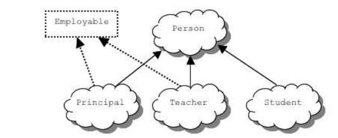

# Interfaces

In Java, an interface is a mechanism that unrelated objects use to interact with each other. Like a protocol, an interface specifies agreed-on behaviors and/or attributes.

The Person class and its class hierarchy define the attributes and behaviors of a person. But a person can interact with the world in other ways. For example, an employment program could manage a person at a school. An employment program isn't concerned with the kinds of items it handles as long as each item provides certain information, such as salary and employee ID. This interaction is enforced as a protocol of method definitions contained within
an interface. The Employable interface would define, but not implement, methods that set and get the salary, assign an ID number, and so on.



To work in the employment program, the Teacher class must agree to this protocol by implementing the interface. To implement an interface, a class must implement all of the methods and attributes defined in the interface. In our example, the shared methods of the Employable interface would be implemented in the Teacher class.

In Java, an interface consists of a set of methods and/or methods, without any associated implementations. Here is an example of Java interface that defines the behaviors of “employability” described earlier:

```java
public interface Employable{
 	public double getSalary();
 	public String getEmployeeID();
 	public void setSalary(double salary);
 	public void setEmployeeID(String id);
}
```

A class implements an interface by defining all the attributes and methods defined in the interface. implements is a reserved word. For example:

```java
public class Teacher implements Employable{
 ...
 public double getSalary() { return mySalary; }
 public int getEmployeeID() { return myEmployeeID; }
 public void setSalary(double salary) { mySalary = salary; }
 public void setEmployeeID(String id) { myEmployeeID = id; }
}
```

A class can implement any number of interfaces. In fact, a class can both extend another class and implement one or more interfaces. So, we can have things like (assuming we have an
interface named Californian)

```java
public class Teacher extends Person implements Employable, Californian{
...
}
```

Interfaces are useful for the following:

- Declaring a common set of methods that one or more classes are required to implement
- Providing access to an object’s programming interface without revealing the details of its
  class.
- Providing a relationship between dissimilar classes without imposing an unnatural class
  relationship.

## Assignment:

- Create a parent class with at least three child classes.
  - Each class should have a `toString()` method.
- Create and implement an interface with a set of common attributes and methods for at least two of the child classes.

`<br></br>`
If you're not feeling inspired, feel free to use one of these examples:

### Option 1:

- **Parent Class:** Book
- **Child Classes:** History, Drama, Mystery, Kid Literaure, Manuals, Reference, Romance
- **Interface:** Educational, Fiction, Non-Fiction

### Option 2:

- **Parent Class:** Plant
- ** Child Classes:** Tree, Shrub, Grass, Tubers
- **Child Class:** Walnut, Oak, Pecan, Tarot, Carrot, Potato, Poison Ivy,
- **Interfaces:** Edible, FruitBearing, NutBearing,
